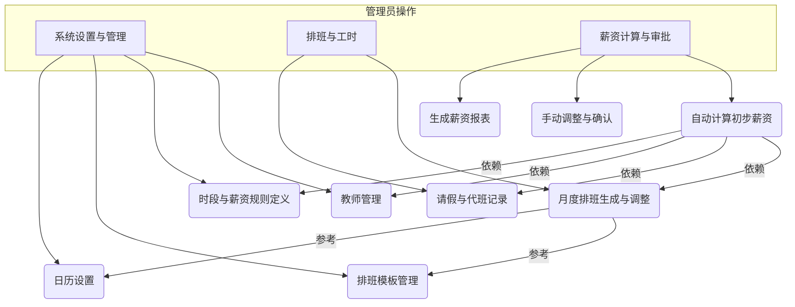

# 教师薪资管理系统 - 规划方案

## 一、系统核心功能模块

1.  **系统设置与管理模块 (Admin Panel)**
    *   **教师管理**:
        *   录入和维护教师基本信息（如姓名、联系方式等）。
        *   灵活设置教师的多种属性，例如：
            *   **默认时薪**: 每位教师的基础时薪，由您设定。
            *   可关联默认的排班模板。
    *   **课程/时段定义**:
        *   自定义教学时段的名称（如：“早自修”、“第1节课”、“晚辅导”等）。
        *   设定每个时段的默认时长（例如：“第1节课”为40分钟）。
        *   设定特殊时薪乘数：为特定类型的时段设置薪资乘数（例如，周末课程或晚间课程的时薪乘数为2.0，即“双倍”薪资）。
    *   **排班模板管理**:
        *   创建和管理通用的周排班模板，定义一周中每天的课程安排。
    *   **日历设置**:
        *   管理月份的工作日和休息日（周末）。节假日按照休息日的薪资规则处理（如果当天有排班）。

2.  **排班与工时模块 (Scheduling & Timesheet)**
    *   **月度排班**:
        *   为每位教师按月生成排班表。可以基于预设的排班模板快速生成，并允许针对个别教师进行调整。
        *   系统根据日历（工作日/休息日）和教师的排班，自动计算每个教学时段的计划分钟数。
    *   **出勤与调整管理**:
        *   记录教师的请假情况。
        *   记录代班情况（哪位老师代了哪位老师的课）。
        *   系统应能根据请假和代班情况，自动调整相关教师的实际工时。

3.  **薪资计算与审批模块 (Payroll Processing)**
    *   **自动计算**:
        *   系统每月汇总每位教师的实际工作分钟数。
        *   根据每个时段的薪资乘数（例如“双倍”），计算有效计薪分钟数。
            *   例如：一个40分钟的课程，如果是“双倍”时段，则计为 40 * 2.0 = 80 分钟的有效计薪时间。
        *   将总有效计薪分钟数转换为小时。
        *   根据教师设定的时薪，计算出初步的月度薪资。
    *   **手动调整与确认**:
        *   允许管理员对自动计算出的薪资进行手动调整（例如，特殊奖金或扣款）。
        *   提供薪资确认功能，确认后的薪资将作为最终发放依据。
    *   **薪资报表**:
        *   生成教师的月度薪资明细表和汇总表。

## 二、系统数据结构初步设想 (Data Models - High Level)

*   **教师 (Teacher)**: 教师ID, 姓名, 默认时薪, 其他自定义属性等。
*   **时段类型 (TimeSlotType)**: 时段ID, 名称, 默认时长, 薪资乘数 (e.g., 1.0, 2.0) 等。
*   **排班模板 (ScheduleTemplate)**: 模板ID, 模板内容 (e.g., 周一至周日各时段安排)。
*   **月度排班记录 (MonthlySchedule)**: 记录ID, 教师ID, 年月, 日期, 时段ID, 实际出勤分钟数, 是否代班, 代班教师ID等。
*   **请假记录 (LeaveRecord)**: 记录ID, 教师ID, 请假开始时间, 结束时间, 事由等。
*   **薪资单 (Payslip)**: 薪资单ID, 教师ID, 年月, 总计薪小时, 基本薪资, 调整金额,最终薪资, 状态 (待确认/已确认) 等。

## 三、系统工作流程示意图

## 四、关键特性总结

*   **灵活性**: 教师属性、课程时段、薪资规则、排班均可灵活配置。
*   **自动化**: 根据排班和日历自动计算工时和基础薪资。
*   **准确性**: 精确处理特殊时段薪资（如双倍）、请假、代班对薪资的影响。
*   **易用性**: 提供清晰的界面进行管理和操作，减少手动计算的复杂性。