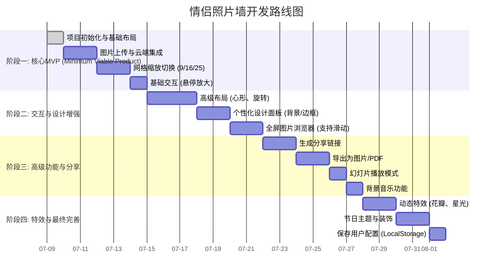

# 情侣照片墙 (Couple's Photo Wall) - 开发计划

## 1. 项目简介

本项目旨在创建一个高度可定制、交互性强的情侣照片墙在线工具。用户可以上传并以多种创意布局（如网格、心形）展示他们的珍贵照片。工具将提供丰富的动画效果、个性化设置和社交分享功能，致力于将美好的回忆以一种独特而浪漫的方式呈现和珍藏。

## 2. 核心功能概览

- **多布局展示**: 支持从 9 宫格到 25 宫格的网格布局，以及心形、旋转相册等特殊布局。
- **流畅动画**: 在缩放、切换和悬停时提供平滑的过渡动画。
- **深度定制**: 用户可自定义背景、边框、标题、主题色和背景音乐。
- **丰富交互**: 支持全屏预览、触摸手势、添加文字描述和“爱的记忆”。
- **分享与保存**: 可生成分享链接，或将整个照片墙导出为图片/PDF。
- **浪漫特效**: 提供季节性、节日性主题和装饰元素，增添氛围。

## 3. 技术选型 (Architecture)

为了实现这些丰富的功能并确保良好的用户体验，我们建议采用以下技术栈：

- **前端框架 (Frontend)**:
  - **HTML5 / CSS3 / JavaScript (ES6+)**: 项目的基础。
  - **建议使用 `Vue.js` 或 `React`**: 对于如此复杂的交互和状态管理，使用现代前端框架可以极大地提高开发效率和代码可维护性。我们将以原生JS为基础进行规划，但强烈建议迁移到框架。

- **图片存储 (Image Storage)**:
  - **关键要求**: 用户需要将照片上传到网络。我们不自建图片服务器，而是采用第三方云存储服务。
  - **方案**: 使用 **Cloudinary**、**七牛云** 或 **AWS S3** 等对象存储服务。
    - **优势**: 可靠、可扩展，并提供强大的图片处理 API（如裁剪、滤镜），有免费额度。
    - **用户操作**: 用户需要在所选平台上注册一个账户，获取 API Key，并配置到我们的工具中。我们会在代码中预留清晰的配置接口。

- **动画库 (Animation)**:
  - **`GSAP (GreenSock Animation Platform)`**: 一个专业级的 JavaScript 动画库，可以轻松实现用户要求的所有流畅、复杂的动画效果。
  - **`CSS Transitions / Animations`**: 用于实现简单的过渡效果，如悬停放大。

- **导出功能 (Exporting)**:
  - **`html2canvas`**: 一个强大的库，可以将网页上的任意 DOM 元素（我们的照片墙）渲染成 Canvas，然后可以轻松保存为图片。
  - **`jsPDF`**: 配合 `html2canvas`，可以将生成的图片嵌入 PDF 文件中。

## 4. 开发阶段规划 (Phased Development Plan)

我们将项目分为四个主要阶段，从核心功能开始，逐步迭代，添加更多高级特性。

### **阶段一：核心 MVP (Minimum Viable Product)**

*目标：构建产品的基本骨架，实现最核心的上传和展示功能。*

1.  **任务 1.1: 项目初始化**
    - 创建 `our-photo-memories` 目录。
    - 创建 `index.html`, `css/style.css`, `js/main.js` 文件结构。
    - 基础 HTML 布局，包含上传区域、照片墙容器和控制按钮区域。
2.  **任务 1.2: 图片上传功能**
    - 实现一个“上传”按钮，并与所选的云存储服务 API 对接。
    - **(需要用户提供云存储的API Key)**
    - 上传成功后，获取图片的 URL 并在照片墙容器中动态创建 `` 元素。
3.  **任务 1.3: 基础网格布局与切换**
    - 使用 CSS Grid 或 Flexbox 实现默认的网格布局。
    - 创建 9、16、25 宫格的切换按钮。
    - 点击按钮时，通过 JavaScript 更改照片墙容器的 CSS 类，以应用不同的网格模板。
4.  **任务 1.4: 基础动画与交互**
    - 为网格切换和图片加载添加简单的 CSS Transition 动画（如淡入、缩放）。
    - 实现鼠标悬停在照片上时，照片微微放大的效果。

### **阶段二：交互与设计增强**

*目标：丰富产品的视觉表现和用户交互体验。*

1.  **任务 2.1: 高级布局**
    - **心形布局**: 通过计算或 SVG `clip-path` 来定位图片，形成心形。
    - **旋转相册**: 使用 CSS 3D Transforms 实现一个可旋转的立体相册效果。
2.  **任务 2.2: 个性化设计**
    - 创建一个设置面板。
    - 添加选项以更改背景（纯色、渐变、自定义图片 URL）。
    - 添加选项以更改照片边框样式（方形、圆角、心形）。
3.  **任务 2.3: 全屏图片浏览器**
    - 点击任意照片时，弹出一个覆盖全屏的模态框（Modal）。
    - 在模态框中显示高清大图，并支持左右箭头或滑动来浏览上一张/下一张。
    - 实现添加和显示日期、地点和文字描述的功能。

### **阶段三：高级功能与分享**

*目标：让用户的创作可以被分享和保存。*

1.  **任务 3.1: 分享功能 (工作原理)**
    - **核心机制**: 为了让任何人都能通过链接看到您的作品，我们需要解决两个问题：1) 图片必须存在于公共网络上；2) 链接必须包含所有布局和图片信息。
    - **步骤 1: 图片云端化**: 当您上传一张照片时，工具会将其发送到您配置的云存储服务（如 Cloudinary）。云服务会返回一个公开的 URL（例如 `https://.../my-photo.jpg`）。这张照片现在对互联网开放了。
    - **步骤 2: 信息编码到链接**: 当您点击“分享”时，工具会收集所有照片的公开 URL 以及您的布局选择（如心形布局、蓝色背景等），将这些信息编码成一长串文本，并附加到网址后面，形成一个独特的分享链接。
    - **步骤 3: 链接解码与复现**: 当您的朋友打开这个链接时，我们页面中的 JavaScript 会自动读取网址后的信息，解码它，然后根据这些信息动态地、一模一样地重新构建出您的照片墙。
    - *高级方案*: 未来可以考虑将配置保存到后端数据库，生成一个更短、更美观的链接。
2.  **任务 3.2: 导出功能**
    - 集成 `html2canvas` 库。
    - 添加“导出为图片”按钮，将照片墙 DOM 元素转换为 PNG 或 JPG 图片并下载。
    - 集成 `jsPDF`，提供“导出为 PDF”选项。
3.  **任务 3.3: 幻灯片与背景音乐**
    - 实现一个自动播放所有照片的幻灯片模式。
    - 添加背景音乐播放器，提供几首内置的浪漫音乐，并支持用户输入在线音乐的 URL。

### **阶段四：特效与最终完善**

*目标：增加趣味性和情感化元素，并提升产品的完整度。*

1.  **任务 4.1: 动态特效**
    - 使用 HTML5 Canvas 在背景上绘制动态效果，如飘落的花瓣、闪烁的星光。
2.  **任务 4.2: 节日主题**
    - 创建预设的节日主题包（如情人节、纪念日），一键切换整体风格（背景、边框、装饰元素）。
3.  **任务 4.3: 保存配置**
    - 使用浏览器的 `localStorage`，在用户关闭页面后仍能保存他们的照片列表和个性化设置，方便下次继续编辑。

---

## 5. 项目部署 (Deployment) - 如何让网站上线

您提的“分享整个网站”正是项目开发的最后一步，我们称之为“部署”。

部署就是将我们编写的所有代码文件（`index.html`, `css/`, `js/`）上传到一个公共的服务器上，这样任何人都可以通过一个简单的网址（例如 `https://my-love-wall.netlify.app`）来访问我们的照片墙制作工具。

完成开发后，我们可以使用以下非常友好且**免费**的平台来部署我们的网站：

-   **GitHub Pages**: 如果我们的代码托管在 GitHub 上，可以一键开启 Pages 功能，免费获得一个网站地址。
-   **Netlify**: 非常流行，只需将我们的代码仓库连接到 Netlify，它就会自动为我们构建和发布网站，操作极其简单。
-   **Vercel**: 与 Netlify 类似，也是一个优秀的前端项目托管平台。

**最终的完整流程是**：
1.  我们完成所有功能的开发。
2.  我们将代码上传到 GitHub。
3.  我们选择 Netlify 或类似平台进行部署，获得一个公共网址。
4.  **任何人**都可以访问这个网址来使用我们的工具。
5.  用户在工具上创作自己的照片墙后，再使用我们设计的“分享链接”功能，分享他们**自己的作品**。

---

## 6. 更新日志 (Changelog)

### **v1.2.0 - 2025-07-12**

-   **【新功能】** 增加了网站进入密码保护功能。现在访问网站需要输入预设的密码 (`20250511`)，有效保护了内容的私密性。
-   **【UI优化】** 将背景音乐的播放/暂停按钮从设置面板移动到了主标题栏的图标区域，使其更易于访问和控制。
-   **【问题修复】** 彻底解决了背景图片透明度设置在某些情况下不生效或无法保存的顽固 bug。现在透明度调整可以即时生效并被正确记录。