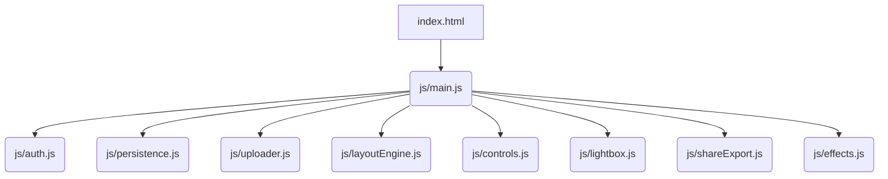

# 照片墙应用修复计划

## 问题

应用程序在加载时卡住，一直显示“加载中”状态，无法正常启动。

## 根本原因分析

通过分析代码，我们发现当前的脚本加载机制存在以下问题：

1.  **脆弱的脚本依赖**：应用使用传统的 `<script>` 标签按顺序加载多个 JavaScript 文件。如果其中任何一个文件加载失败或执行出错，都会阻塞后续脚本的执行，导致应用初始化失败。
2.  **不确定的 `DOMContentLoaded` 事件**：应用启动逻辑依赖于 `DOMContentLoaded` 事件。在复杂的加载场景下，如果脚本执行出现问题，该事件可能被延迟触发，甚至永远不会触发，导致应用无法启动。

## 修复方案

为了解决上述问题，我们将对项目的脚本加载和模块管理机制进行现代化改造，采用 ES6 模块来提升应用的健壮性和可维护性。

### 详细步骤

1.  **更新 HTML 脚本加载 (`index.html`)**
    *   移除所有单独的 `.js` 文件 `<script>` 标签。
    *   只保留一个指向 `js/main.js` 的脚本引用，并为其添加 `type="module"` 属性。这将把 `js/main.js` 指定为应用的模块化入口点。

    **修改前:**
    ```html
    <script src="js/persistence.js"></script>
    <script src="js/auth.js"></script>
    ...
    <script src="js/main.js"></script>
    <script>
        document.addEventListener('DOMContentLoaded', async () => {
            window.app = new PhotoWallApp();
            await window.app.init();
        });
    </script>
    ```

    **修改后:**
    ```html
    <script type="module" src="js/main.js"></script>
    ```

2.  **重构 JavaScript 模块**

    *   **`js/main.js` (应用入口)**
        *   在文件顶部，使用 `import` 语句导入所有必需的模块（`AuthManager`, `PersistenceManager`, 等）。
        *   移除 `DOMContentLoaded` 事件监听器和旧的类检查逻辑，直接创建 `PhotoWallApp` 实例并执行初始化。ES6 模块会自动处理依赖加载顺序。

    *   **所有其他 `js/*.js` 模块**
        *   在每个模块文件的末尾，使用 `export` 关键字导出相应的类。例如，在 `js/auth.js` 的末尾添加 `export { AuthManager };`。

### 模块依赖关系图

修复后的模块依赖关系将更加清晰和可管理：



## 预期收益

*   **提高健壮性**：ES6 模块提供了更可靠的依赖管理和错误处理机制。
*   **提升性能**：现代浏览器可以对模块进行优化，实现更高效的加载。
*   **改善可维护性**：代码结构更清晰，依赖关系一目了然，便于未来扩展和维护。