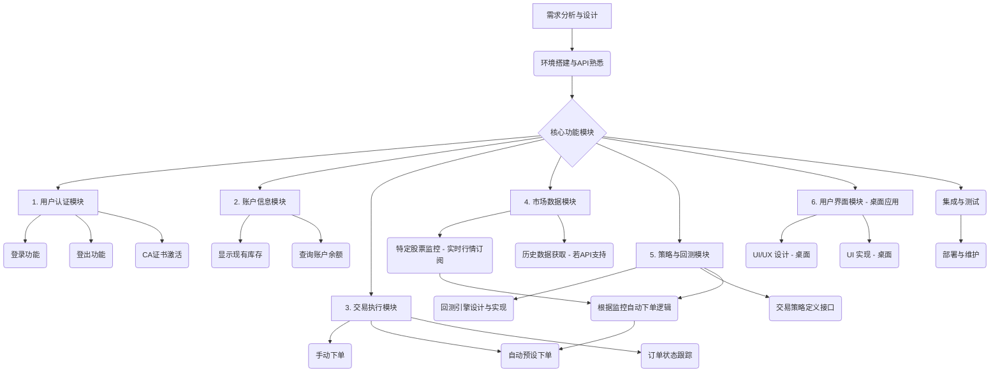

# 股票交易工具开发计划

**目标：** 开发一个基于 `shioaji` API 的股票交易工具，实现用户登录、登出、库存显示、自动/手动下单、特定股票监控、回测以及根据监控状况自动下单等功能。

**核心技术栈：**
*   **后端/核心逻辑：** Python (利用 `shioaji` API)
*   **用户界面 (UI)：** 桌面应用程序 (例如使用 Tkinter 或 PyQt)
*   **数据存储 (可选)：** 数据库 (如 SQLite, PostgreSQL) 用于存储交易记录、回测数据、用户配置等。

**开发阶段与模块：**

**模块详细说明：**

1.  **用户认证模块 (User Authentication Module)**
    *   **功能：**
        *   实现用户通过 `shioaji` API 登录 (`api.login()`)。
        *   处理 CA 证书的激活 (`api.activate_ca()`)。
        *   实现用户登出功能 (需要研究 API 是否有显式登出方法，或通过资源释放实现)。
    *   **依赖：** `shioaji` API。

2.  **账户信息模块 (Account Information Module)**
    *   **功能：**
        *   显示用户当前的股票库存/持仓 (需要研究 API 是否提供此功能，或通过交易记录推算)。
        *   查询账户余额等相关信息。
    *   **依赖：** `shioaji` API。

3.  **交易执行模块 (Trade Execution Module)**
    *   **功能：**
        *   **手动下单：** 提供界面供用户输入股票代码、价格、数量、买卖方向等，调用 `api.place_order()` 执行。
        *   **自动预设下单：** 允许用户预设下单条件（如特定价格、时间），到条件满足时自动执行。
        *   订单状态跟踪与管理。
    *   **依赖：** `shioaji` API (`api.Order`, `api.place_order`)。

4.  **市场数据模块 (Market Data Module)**
    *   **功能：**
        *   **特定股票监控：** 使用 `api.quote.subscribe()` 订阅指定股票的实时行情数据 (tick, bid/ask)。
        *   处理和展示实时数据。
        *   **历史数据获取：** 研究 `shioaji` API 是否提供历史K线数据等功能，用于回测。若不提供，则考虑引入第三方数据源。
    *   **依赖：** `shioaji` API (`api.quote.subscribe`, `api.Contracts`)。

5.  **策略与回测模块 (Strategy & Backtesting Module)**
    *   **功能：**
        *   **回测引擎：**
            *   如果 API 支持历史数据，则基于历史数据进行策略回测。
            *   如果 API 不支持，则需要设计数据导入和管理机制。
            *   模拟交易逻辑，计算策略表现（收益率、夏普比率等）。
        *   **交易策略定义：** 提供接口或方式让用户定义自己的交易策略。
        *   **根据监控自动下单逻辑：** 结合市场数据模块的实时监控，当满足预设策略条件时，自动调用交易执行模块下单。
    *   **依赖：** 市场数据模块、交易执行模块。

6.  **用户界面模块 (User Interface Module - 桌面应用)**
    *   **功能：**
        *   提供用户友好的桌面操作界面，用于登录、查看信息、手动下单、设置监控、配置策略、查看回测结果等。
        *   技术选型：Tkinter, PyQt, Kivy 等 Python GUI 框架。
    *   **依赖：** 所有其他核心模块。

**待确认和研究的事项：**

*   **API 登出机制：** `shioaji` API 是否有明确的登出函数。
*   **获取账户持仓/库存：** API 是否直接提供查询当前持仓的功能。
*   **历史数据接口：** API 是否提供历史行情数据，这对回测功能至关重要。
*   **错误处理与异常管理：** API 调用可能出现的各种错误及其处理方式。
*   **并发与异步处理：** 实时数据订阅和自动交易可能需要异步处理。
*   **安全性：** API 密钥、CA 证书密码等敏感信息的安全存储和管理。