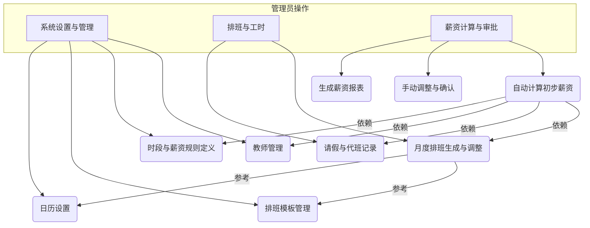

# 教师薪资管理系统 - 规划方案

## 一、系统核心功能模块

1.  **系统设置与管理模块 (Admin Panel)**
    *   **教师管理**:
        *   录入和维护教师基本信息（如姓名、联系方式等）。
        *   灵活设置教师的多种属性，例如：
            *   **默认时薪**: 每位教师的基础时薪，由您设定。
            *   可关联默认的排班模板。
    *   **课程/时段定义**:
        *   自定义教学时段的名称（如：“早自修”、“第1节课”、“晚辅导”等）。
        *   设定每个时段的默认时长（例如：“第1节课”为40分钟）。
        *   设定特殊时薪乘数：为特定类型的时段设置薪资乘数（例如，周末课程或晚间课程的时薪乘数为2.0，即“双倍”薪资）。
    *   **排班模板管理**:
        *   创建和管理通用的周排班模板，定义一周中每天的课程安排。
    *   **日历设置**:
        *   管理月份的工作日和休息日（周末）。节假日按照休息日的薪资规则处理（如果当天有排班）。

2.  **排班与工时模块 (Scheduling & Timesheet)**
    *   **月度排班**:
        *   为每位教师按月生成排班表。可以基于预设的排班模板快速生成，并允许针对个别教师进行调整。
        *   系统根据日历（工作日/休息日）和教师的排班，自动计算每个教学时段的计划分钟数。
    *   **出勤与调整管理**:
        *   记录教师的请假情况。
        *   记录代班情况（哪位老师代了哪位老师的课）。
        *   系统应能根据请假和代班情况，自动调整相关教师的实际工时。

3.  **薪资计算与审批模块 (Payroll Processing)**
    *   **自动计算**:
        *   系统每月汇总每位教师的实际工作分钟数。
        *   根据每个时段的薪资乘数（例如“双倍”），计算有效计薪分钟数。
            *   例如：一个40分钟的课程，如果是“双倍”时段，则计为 40 * 2.0 = 80 分钟的有效计薪时间。
        *   将总有效计薪分钟数转换为小时。
        *   根据教师设定的时薪，计算出初步的月度薪资。
    *   **手动调整与确认**:
        *   允许管理员对自动计算出的薪资进行手动调整（例如，特殊奖金或扣款）。
        *   提供薪资确认功能，确认后的薪资将作为最终发放依据。
    *   **薪资报表**:
        *   生成教师的月度薪资明细表和汇总表。

## 二、系统数据结构初步设想 (Data Models - High Level)

*   **教师 (Teacher)**: 教师ID, 姓名, 默认时薪, 其他自定义属性等。
*   **时段类型 (TimeSlotType)**: 时段ID, 名称, 默认时长, 薪资乘数 (e.g., 1.0, 2.0) 等。
*   **排班模板 (ScheduleTemplate)**: 模板ID, 模板内容 (e.g., 周一至周日各时段安排)。
*   **月度排班记录 (MonthlySchedule)**: 记录ID, 教师ID, 年月, 日期, 时段ID, 实际出勤分钟数, 是否代班, 代班教师ID等。
*   **请假记录 (LeaveRecord)**: 记录ID, 教师ID, 请假开始时间, 结束时间, 事由等。
*   **薪资单 (Payslip)**: 薪资单ID, 教师ID, 年月, 总计薪小时, 基本薪资, 调整金额,最终薪资, 状态 (待确认/已确认) 等。

## 三、系统工作流程示意图



## 四、关键特性总结

*   **灵活性**: 教师属性、课程时段、薪资规则、排班均可灵活配置。
*   **自动化**: 根据排班和日历自动计算工时和基础薪资。
*   **准确性**: 精确处理特殊时段薪资（如双倍）、请假、代班对薪资的影响。
*   **易用性**: 提供清晰的界面进行管理和操作，减少手动计算的复杂性。

---

## 五、系统使用说明

### 1. 引言

欢迎使用 **教师薪资管理系统**！

本系统是一个基于网页的本地应用程序，旨在帮助学校或教育机构的管理者高效、准确地处理教师的排班、工时统计以及薪资计算等事务。通过本系统，您可以：

*   自定义课程时段和薪资规则。
*   管理教师的基本信息和默认排班。
*   轻松创建和调整月度排班表。
*   记录教师的请假和代班情况。
*   自动化大部分薪资计算过程，并进行必要的调整和确认。

本用户指南将详细介绍系统的各项功能模块及操作方法，希望能帮助您快速上手并充分利用本系统提高工作效率。

### 2. 重要提示

在开始使用本系统前，请务必仔细阅读以下重要提示：

*   **数据存储**: 本系统的所有数据（包括您输入的教师信息、课程设置、排班记录、薪资单等）都存储在您当前使用的**网页浏览器的 `localStorage`（本地存储）中**。
    *   这意味着数据是保存在您的本地计算机上的，**不会自动上传到任何云端服务器**。
    *   **优点**: 无需联网即可使用，数据隐私性较高（仅限本机访问）。
    *   **缺点**:
        *   数据**不会在不同设备或不同浏览器之间自动同步**。如果您在一台电脑的 Chrome 浏览器中输入了数据，在另一台电脑或同一台电脑的 Firefox 浏览器中将无法看到这些数据。
        *   如果**清除浏览器缓存/历史记录时选择了清除网站数据/本地存储**，或者特定地清除了本系统（通常是 `index.html` 文件所在域名或 `file://` 路径）的本地存储，**将会导致所有已存数据丢失且无法恢复**。
        *   使用浏览器的“隐私模式”或“无痕模式”通常不会保存 `localStorage` 数据，或者在关闭窗口后即清除。

*   **数据备份与恢复**:
    *   系统目前**不提供内置的自动备份或一键导出/导入功能**。
    *   强烈建议您定期手动备份重要数据。具体方法请参见后续【数据管理】章节中的说明。

*   **浏览器兼容性**:
    *   建议使用最新版本的现代主流网页浏览器，如 **Google Chrome**, **Mozilla Firefox**, **Microsoft Edge** 等，以获得最佳的使用体验和兼容性。
    *   不保证在较旧版本浏览器或非主流浏览器上的所有功能都能正常工作。

*   **系统重置**:
    *   如果您希望将系统恢复到初始状态（清除所有用户数据，仅保留预设的默认课程和教师），可以手动清除浏览器的 `localStorage`。具体方法请参见【数据管理】章节。**此操作不可逆，请谨慎执行。**

### 3. 快速上手

#### 3.1 系统访问

1.  确保您已从管理员处获取本系统的所有文件，通常会包含一个主文件 `index.html` 以及 `css` 和 `js` 文件夹。
2.  将所有文件放置在您计算机的同一个文件夹内。
3.  使用推荐的网页浏览器（如 Chrome, Firefox, Edge）打开主文件夹下的 `index.html` 文件。
    *   您可以通过在文件管理器中双击 `index.html`，或者在浏览器地址栏输入文件的本地路径（例如 `file:///C:/path/to/your/folder/index.html`）来访问。
4.  系统加载完成后，您将看到主界面。

#### 3.2 首次使用与默认数据

当您第一次在本浏览器中打开本系统时（即 `localStorage` 中没有本系统的数据时），系统会自动进行一次初始化，并载入一批**默认数据**，以方便您快速了解和开始使用：

*   **默认课程/时段类型**:
    *   系统会根据一份预设的课程表（源自用户提供的Excel表头信息）创建一系列常用的教学时段，例如：“早自修”、“第1节”、“第2节”...“第7节”、“午餐”、“午休”、“打掃時間”等。
    *   每个时段都会有预设的**默认时长**（如40分钟）和**薪资乘数**（如常规课程为1.0，午餐/午休等不计薪时段为0.0）。
*   **默认教师列表**:
    *   系统会根据一份预设的教师名单（源自用户提供的Excel教师名录）创建教师记录。
    *   所有默认添加的教师会被赋予一个统一的**默认时薪**（例如190元/小时），并且其**每周固定排班**初始为空。

**重要**: 这些默认数据仅为方便您上手体验。您可以在后续的“系统设置”模块中，根据您的实际需求**自由修改、删除这些默认数据，或添加新的数据**。

#### 3.3 界面概览

系统主界面通常由以下几个主要部分构成：

*   **导航栏 (Navigation Bar)**: 位于页面顶部或侧边，包含指向系统各个主要功能模块的链接/按钮。
    *   **系统设置 (Settings)**: 点击此处 ([`index.html`](teacher-payroll-system/index.html:16) 中的 `nav-settings` 按钮) 进入系统基础配置界面。
    *   **排班与工时 (Schedule & Hours)**: 点击此处 ([`index.html`](teacher-payroll-system/index.html:17) 中的 `nav-schedule` 按钮) 进入排班管理和工时调整界面。
    *   **薪资计算 (Payroll)**: 点击此处 ([`index.html`](teacher-payroll-system/index.html:18) 中的 `nav-payroll` 按钮) 进入薪资处理界面。
*   **内容显示区 (Content Area)**: 导航栏下方的主区域，用于显示当前选定功能模块的具体内容和操作界面。

通过点击导航栏中的不同选项，内容显示区会相应地切换到对应的功能模块。应用启动后，默认显示的是“系统设置”模块。

### 4. 主要功能用法

本章节将详细介绍系统三大核心模块的具体操作方法。

#### 4.1 系统设置 (`settings-section`)

“系统设置”模块是整个应用的基础，您需要在这里配置好课程时段、教师信息等核心数据，才能顺利进行后续的排班和薪资计算。

**如何进入**: 点击导航栏中的“系统设置”按钮。

##### 4.1.1 课程/时段管理 (Managing Course/Timeslot Types)

此部分用于定义学校或机构中的各种教学时段或课程类型，并设定其基本属性。

*   **目的**: 为后续的排班和薪资计算提供标准化的时段单位。每个时段可以有不同的时长和薪资计算权重。
*   **界面**: 通常会有一个列表显示已有的课程/时段，以及用于添加和编辑的表单。

*   **查看现有课程/时段**:
    *   在“课程/时段定义”区域，您会看到一个列表，展示了所有已定义的课程/时段，通常包含其ID（系统自动生成）、名称、默认时长（分钟）和薪资乘数。

*   **添加新课程/时段**:
    1.  找到并点击“管理时段”按钮，然后通常在展开的编辑区域内会有“新增时段”的部分。
    2.  **ID**: 此字段通常由系统自动生成（例如 `TS1678886400000123`），您无需填写。
    3.  **名称**: 输入课程/时段的描述性名称，例如“早自修”、“数学辅导”、“周末编程班第一节”。
    4.  **默认时长(分钟)**: 输入该时段的标准持续时间，以分钟为单位（例如 `40`）。
    5.  **薪资乘数**: 设定该时段在计算薪资时的权重。
        *   `1.0`: 表示按教师的正常时薪计算。
        *   `0.0`: 表示该时段不计薪（例如“午休”、“午餐”）。
        *   `1.5`: 表示按1.5倍时薪计算。
        *   `2.0`: 表示按2倍时薪计算（例如，用于周末或晚间特殊课程）。
    6.  填写完毕后，点击“添加”按钮。新时段会出现在列表中。

*   **编辑现有课程/时段**:
    1.  在“管理时段”的编辑区域的表格中，找到您希望修改的课程/时段。
    2.  直接在对应的输入框中修改其名称、默认时长或薪资乘数。
    3.  修改完成后，点击该行对应的“更新”按钮。

*   **删除课程/时段**:
    1.  在“管理时段”的编辑区域的表格中，找到您希望删除的课程/时段。
    2.  点击该行对应的“删除”按钮。系统通常会弹出确认提示，确认后即可删除。
    3.  **注意**: 如果某个时段类型已被用于排班或模板中，删除它可能会导致相关数据引用失效。请谨慎操作。

##### 4.1.2 教师管理 (Managing Teachers)

此部分用于管理所有教师的基本信息、默认时薪以及非常关键的每周固定排班。

*   **目的**: 维护教师档案，设定薪资计算基础，并通过默认排班简化日常排班工作。
*   **界面**: 通常包含一个教师列表和用于添加/编辑教师信息的表单/区域。

*   **查看教师列表**:
    *   在“教师管理”区域，您会看到一个列表，展示了所有已添加的教师及其基本信息（如姓名、默认时薪）。

*   **添加新教师**:
    1.  点击“管理教师”按钮，然后在展开的编辑区域内会有“新增教师”的部分。
    2.  **ID**: 系统自动生成，无需填写。
    3.  **姓名**: 输入教师的姓名。
    4.  **默认时薪**: 输入该教师的标准时薪金额（例如 `190`）。
    5.  填写完毕后，点击“添加”按钮。新教师会出现在列表中。其“每周固定排课”默认为空。

*   **编辑教师信息**:
    1.  在“管理教师”的编辑区域的表格中，找到您希望修改的教师。
    2.  直接修改其姓名或默认时薪。
    3.  点击该行对应的“更新”按钮。

*   **删除教师**:
    1.  在“管理教师”的编辑区域的表格中，找到您希望删除的教师。
    2.  点击该行对应的“删除”按钮。系统会提示确认，确认后删除。
    3.  **注意**: 删除教师后，其相关的历史排班和薪资数据可能仍会保留（取决于系统设计），但无法再为其安排新的排班。

*   **设置每周固定排课 (Setting Weekly Default Schedule)**:
    *   此功能允许您为每位教师预设一周七天（周日到周六）中相对固定的上课安排。在生成月度排班时，可以基于此默认排班快速填充。
    1.  在“管理教师”的编辑区域的表格中，找到目标教师。
    2.  点击该教师条目下方的“设置每周固定排课”按钮，会展开详细设置区域。
    3.  对于周日到周六的每一天，您会看到一个包含所有已定义“课程/时段类型”的复选框列表。
    4.  勾选教师在该天需要固定上的课程/时段。例如，如果某教师每周一固定上“第1节”和“第2节”，则在“周一”对应的区域勾选这两个时段。
    5.  完成一周七天的设置后，点击“保存每周固定排课”按钮。
    6.  您可以随时回来修改这些设置。

##### 4.1.3 排班模板管理 (Managing Schedule Templates)

排班模板允许您创建可复用的周排班模式，方便在生成月度排班时快速应用。

*   **目的**: 提高排班效率，特别适用于有固定教学模式的情况。
*   **界面**: 包含模板列表和模板编辑器。

*   **查看现有模板**:
    *   在“排班模板管理”区域，您会看到已创建的模板列表。

*   **添加新模板/编辑模板**:
    1.  点击“管理模板”按钮，会展开模板编辑器。
    2.  **新增模板**:
        *   在“模板名称”输入框中为新模板命名（例如“标准小学周课表”、“初三冲刺周模板”）。
        *   对于周日到周六的每一天：
            *   从该天对应的下拉选择框中选择一个“课程/时段类型”。
            *   选中的时段会自动添加到当天的排班列表中。您可以为一天添加多个不同的时段。
            *   如果添加错误，可以点击时段名称旁边的 `x` 按钮移除。
        *   完成一周七天的设置后，点击“添加模板”按钮（如果是新增）。
    3.  **编辑模板**:
        *   从模板列表中点击模板旁的“查看/编辑”按钮，该模板的名称和每日排班会加载到编辑器中。
        *   您可以修改模板名称，或增删每日的课程/时段。
        *   修改完成后，点击“保存更改”按钮。

*   **删除模板**:
    *   在模板列表中，点击模板旁的“删除”按钮，确认后即可删除。

##### 4.1.4 日历设置 (Calendar Settings)

*   此功能在当前版本中标记为“**待开发**”。
*   其设计初衷可能是用于管理全局的校历，例如标记法定节假日、调休工作日等，以便更精确地影响排班和薪资计算。目前，系统的排班主要基于标准的周循环。

#### 4.2 排班与工时管理 (`schedule-section`)

此模块是日常排班工作的核心，用于为教师安排具体的月度课程、记录请假和处理代班。

**如何进入**: 点击导航栏中的“排班与工时”按钮。

##### 4.2.1 查看与编辑月度排班 (Viewing and Editing Monthly Schedule)

*   **界面**:
    *   顶部会有月份选择器（例如 `2024-07`）和教师选择下拉框。
    *   下方是月度排班日历表，横向为日期，纵向为课程/时段。

*   **加载排班**:
    1.  使用顶部的月份选择器选择您希望查看或编辑的年份和月份。
    2.  从教师下拉框中选择目标教师。
    3.  系统会自动加载并显示该教师在该选定月份的排班表。

*   **理解排班表**:
    *   表格的每一行代表一个“课程/时段类型”（如“早自修”、“第1节”）。
    *   表格的每一列代表选定月份的一天（如 `07/01 周一`, `07/02 周二`）。
    *   单元格内容表示教师在该日该时段的排班状态：
        *   `<span style="color: #aaa;">默认✓</span>`: 表示该安排来源于教师的“每周固定排课”，尚未被实际排班覆盖或取消。
        *   `<span style="color: green;">✓</span>`: 表示这是为教师实际安排的课程。
        *   `<span style="color: blue;">代✓</span>`: 表示该教师在此时代别人的课，或者自己的课被别人代了（具体需要结合编辑弹窗确认）。
        *   `<span style="color: orange;">假</span>`: 表示教师在此时段请假。
        *   `-`: 表示该时段无任何安排。

*   **编辑排班单元格**:
    *   系统允许直接在排班表的单元格上进行交互式编辑。
    1.  **点击单元格**: 在月度排班表中，点击任意一个单元格（代表特定教师在特定日期特定时段的安排）。
    2.  **编辑弹窗**: 系统会弹出一个编辑窗口，显示当前教师、日期和时段信息。
    3.  **操作选项**:
        *   **是否代班?**:
            *   勾选此项，表示这是一个代班安排。
            *   **代班教师**: 如果勾选了“是否代班”，则需要从下拉列表中选择实际执行代班的教师。**注意**：如果原教师A的课被教师B代了，那么在教师A的排班表上，这个时段应该记录为被代班（通常显示为空或特殊标记，工时不计给A），而在教师B的排班表上，这个时段应该记录为教师B的代班（工时计给B）。系统目前的实现是，如果勾选“是否代班”并选择了代班教师，则此工时会计给**代班教师**。原排班教师的此格会相应调整。
        *   **按钮**:
            *   **保存修改**: 如果当前单元格已有实际排班记录，此按钮用于保存对代班状态或代班教师的修改。
            *   **删除此排班**: 如果当前单元格已有实际排班记录，此按钮用于删除该条实际排班记录。删除后，如果该时段有默认排班，则会恢复显示默认排班状态。
            *   **添加/应用排班**: 如果当前单元格是空白或仅显示默认排班，此按钮用于将此格应用为实际排班（如果设置了代班，则按代班逻辑处理）。
            *   **取消**: 关闭编辑弹窗，不保存任何更改。
    4.  完成操作后，点击相应按钮。排班表会自动刷新以显示更改。

##### 4.2.2 请假与代班管理 (Managing Leave and Substitutions)

此部分用于集中管理教师的请假记录。请假记录会直接影响排班显示和最终的薪资计算。

*   **界面**:
    *   通常在“排班与工时”模块下方，有一个“请假与代班管理”区域。
    *   点击“管理请假”按钮会展开请假记录列表和新增/编辑表单。

*   **查看请假记录**:
    *   展开后，您会看到一个表格，列出了所有已添加的请假记录，通常包含教师姓名、请假类型、开始日期、结束日期、事由以及操作按钮（编辑/删除）。

*   **添加新请假记录**:
    1.  在“新增请假记录”表单中：
        *   **教师**: 从下拉列表中选择请假的教师。
        *   **请假类型**: 选择请假类别（如事假、病假、年假等）。
        *   **开始日期**: 选择请假开始的日期。
        *   **结束日期**: 选择请假结束的日期。**注意**: 结束日期应等于或晚于开始日期。
        *   **事由**: (可选) 填写请假的简要原因。
    2.  点击“添加请假记录”按钮。记录会出现在列表中，并且在对应教师的月度排班表上，请假时段会标记为“假”。

*   **编辑请假记录**:
    1.  在请假记录列表中，找到需要修改的记录，点击其对应的“编辑”按钮。
    2.  记录的详细信息会加载到下方的“编辑请假记录”表单中。
    3.  修改所需信息。
    4.  点击“保存修改”按钮。

*   **删除请假记录**:
    1.  在请假记录列表中，找到需要删除的记录，点击其对应的“删除”按钮。
    2.  系统会提示确认，确认后即可删除。相关的排班表和薪资计算会自动更新。

*   **关于代班**:
    *   虽然此区域名为“请假与代班管理”，但从代码实现来看，**代班的实际操作主要是在编辑月度排班表的单元格时进行的**（如4.2.1节所述），而不是在这里有单独的代班记录表。
    *   请假记录本身不直接指定代班教师，代班是在排班时针对具体课程进行的调整。

#### 4.3 薪资计算与审批 (`payroll-section`)

此模块用于根据教师的实际工时（已考虑排班、请假、代班和薪资乘数）计算薪资，并允许进行调整和最终确认。

**如何进入**: 点击导航栏中的“薪资计算”按钮。

##### 4.3.1 生成与查看薪资签到表 (Generating and Viewing Payroll Sign-in Sheet)

*   **界面**:
    *   顶部会有月份选择器和教师选择下拉框。
    *   下方是薪资签到表显示区域。

*   **操作流程**:
    1.  **选择月份**: 使用顶部的月份选择器选择您希望计算薪资的年份和月份。
    2.  **选择教师**: 从教师下拉框中选择目标教师。
    3.  系统会自动根据所选教师和月份，拉取所有相关数据（该教师的默认时薪、该月所有课程/时段的定义、该教师的月度排班记录、请假记录等），并动态计算生成一份详细的“薪资签到表”。

*   **理解薪资签到表**:
    *   **表头**: 通常包含“新北市後埔國小 XXX學年度 第X學期 X月份 助理员签到表 - [教师姓名]”等信息。
    *   **每日记录 (按日期排列)**:
        *   **日期/星期**: 显示当月每一天及其对应的星期。
        *   **节次/时间/各课程时段**: 列出当天所有定义的课程/时段。
        *   **工时记录**:
            *   对于每个课程/时段，单元格内会显示该教师在此期间的**有效计薪分钟数**。这个数字是根据课程/时段的`默认时长 * 薪资乘数`计算得出的。
            *   如果教师在该时段**请假**，则显示“请假”，工时为0。
            *   如果教师的课被**他人代班**，则显示“代:[代班教师姓名]”，工时为0。
            *   如果教师在此时代**别人的课**，则正常显示其有效计薪分钟数。
            *   如果该时段无排班，则为空或显示特定标记。
    *   **小计行**:
        *   在每日记录下方，会有一行“小計(分鐘)”，分别汇总每个课程/时段类型当月的总有效计薪分钟数。
    *   **底部汇总与薪资详情**:
        *   **總計 (分鐘)**: 当月所有课程/时段的总有效计薪分钟数。
        *   **總計 (小時)**: 将总分钟数转换为小时数（通常保留两位小数）。
        *   **每小時薪資**: 显示该教师在“系统设置”中配置的默认时薪。
        *   **本月工時薪資**: 根据“总计(小时)”和“每小时薪资”计算得出的基本薪资。
        *   **調整金額**: 一个输入框，允许您输入正数（奖金）或负数（扣款）来调整薪资。默认为0。
        *   **最終薪資**: 根据“本月工时薪资”和“调整金额”实时计算并显示的最终应发薪资。
        *   **備註**: 一个文本框，允许您填写关于薪资调整或其他事项的备注。
        *   **狀態**: 显示当前薪资单的状态，默认为“未确认”。
        *   **操作按钮**: “保存”和“确认”按钮。
        *   **签名栏**: “簽 名 ：_________________________”供线下使用。

##### 4.3.2 薪资调整与备注 (Payroll Adjustments and Notes)

*   在生成的薪资签到表底部：
    *   **调整金额**: 在“調整金額”对应的输入框中，您可以输入具体的数值来增加或减少薪资。例如，输入 `100` 表示增加100元，输入 `-50` 表示扣除50元。修改此金额后，“最終薪資”会自动更新。
    *   **备注**: 在“備註”输入框中，您可以填写进行薪资调整的原因，或其他需要记录的相关信息。

##### 4.3.3 保存与确认薪资单 (Saving and Confirming Payslip)

对薪资数据核对或调整后，您可以进行保存或最终确认操作。

*   **保存薪资单**:
    *   点击“保存”按钮。
    *   系统会将当前教师、当前月份的薪资签到表中的所有信息（包括计算出的薪资、调整金额、备注以及“未确认”状态）保存到浏览器的 `localStorage` 中。
    *   保存后，您下次查看该教师该月份的薪资单时，会加载已保存的数据。只要状态还是“未确认”，您仍然可以修改调整金额和备注，并再次保存。

*   **确认薪资单**:
    1.  **仔细核对**: 在执行“确认”操作前，请务必确保薪资签到表中的所有数据（特别是最终薪资）准确无误。
    2.  点击“确认”按钮。
    3.  系统通常会弹出一个提示，询问您是否确定要确认，并告知确认后将无法修改。
    4.  一旦确认：
        *   该薪资单的状态会变为“**已确认**”。
        *   “调整金额”输入框、“备注”输入框以及“保存”、“确认”按钮通常会变为**禁用状态**，防止进一步修改。
    *   **重要**: 薪资单一经确认，即视为最终版本，用于后续的薪资发放参考。请务必谨慎操作。

##### 4.3.4 薪资报表 (Payroll Reports)

*   此功能在当前版本中标记为“**待开发**”。
*   其设计目标可能是为了能够生成所有教师或特定教师群体的月度/年度薪资汇总报表，或者提供数据导出功能。

### 5. 数据管理

#### 5.1 数据存储位置与特性

如【重要提示】中所述，本系统的所有数据均存储在您当前使用的**网页浏览器的 `localStorage`** 中。

*   **键名**: 数据以键值对的形式存储，使用的键名包括：
    *   `payroll_teachers`: 存储教师列表及详细信息。
    *   `payroll_timeslot_types`: 存储课程/时段类型定义。
    *   `payroll_schedule_templates`: 存储排班模板。
    *   `payroll_monthly_schedules`: 存储月度排班记录。其结构通常是 `{'YYYY-MM': [排班条目, ...]}`。
    *   `payroll_leave_records`: 存储请假记录。
    *   `payroll_payslips`: 存储薪资单数据。其结构通常是 `{'YYYY-MM': {'teacherId': {薪资详情}, ...}}`。

#### 5.2 数据备份与恢复 (手动)

由于系统不提供自动备份，强烈建议您定期手动备份数据，尤其是在进行了大量数据输入或重要更改之后。

**如何手动查看并备份 `localStorage` 数据 (以Google Chrome为例):**

1.  在教师薪资管理系统的页面上，按 `F12` 键（或者右键点击页面选择“检查”或“Inspect”）打开浏览器开发者工具。
2.  在开发者工具窗口中，找到并切换到 **“Application”** (应用) 标签页。
3.  在左侧的导航面板中，展开 **“Storage”** (存储) 部分，然后点击 **“Local Storage”**。在下拉列表中，选择代表当前页面的源（如果您是本地打开 `index.html`，它通常显示为 `file://`）。
4.  此时，右侧会显示当前源（即本系统）在 `localStorage` 中存储的所有键值对。您可以看到如 `payroll_teachers`, `payroll_timeslot_types` 等键。
5.  **备份操作**:
    *   点击您想要备份的键（例如 `payroll_teachers`）。
    *   下方会显示该键对应的值（通常是一段JSON格式的文本）。
    *   选中并**复制**这段完整的JSON文本。
    *   将复制的内容粘贴到一个安全的文本文件（例如 `.txt` 文件）中，并妥善保存该文件。建议为文件名注明日期和数据类型（例如 `payroll_teachers_backup_20240715.txt`）。
    *   对所有需要备份的数据键重复此操作。

**如何手动恢复 `localStorage` 数据 (以Google Chrome为例, 需谨慎操作):**

1.  确保您已在新浏览器或清理过的浏览器中打开了本系统的 `index.html` 页面。
2.  打开开发者工具，并导航到 “Application” > “Local Storage” > 对应的源。
3.  在开发者工具的 **“Console”** (控制台) 标签页中，您可以执行 JavaScript 命令来写入数据。
4.  对于每一个您之前备份的键值对，执行如下命令：
    ```javascript
    localStorage.setItem('键名', '您备份的JSON字符串值');
    ```
    例如，要恢复教师数据，命令可能如下（请将 `'备份的JSON教师数据'` 替换为您实际备份的JSON内容）：
    ```javascript
    localStorage.setItem('payroll_teachers', '[{"id":"T167...", "name":"张三", ...}]');
    ```
5.  **重要**: 粘贴的JSON字符串必须是有效的，并且与原数据结构一致。引号、括号等都需要正确。
6.  执行命令后，刷新系统页面，检查数据是否已恢复。

**警告**: 手动操作 `localStorage` 具有一定风险。不正确的修改可能导致数据损坏或应用无法正常运行。建议在操作前对现有 `localStorage` (如果非空) 也进行一次备份。

#### 5.3 清除数据 / 系统重置

如果您希望清除所有已输入的数据，将系统恢复到包含预设默认数据的初始状态，您需要清除浏览器为本系统存储的所有 `localStorage` 数据。

**方法一: 逐个删除键**
1.  按照上述步骤打开开发者工具并导航到 “Application” > “Local Storage” > 对应的源。
2.  找到所有以 `payroll_` 开头的键。
3.  右键点击每一个这样的键，选择 “Delete” (删除)。

**方法二: 清除站点所有本地数据 (更彻底)**
1.  在开发者工具的 “Application” 标签页下，找到左侧面板的 **“Clear storage”** (清除存储数据) 选项。
2.  在右侧视图中，确保 **“Local and session storage”** (本地和会话存储) 被勾选。您可以取消勾选其他项如 Cookies, Cache 等（如果只想清除本地存储）。
3.  点击 **“Clear site data”** (清除站点数据) 按钮。

**警告**: 以上任一清除操作都将**永久删除**所有与本系统相关的数据，且**无法恢复**（除非您有手动备份）。在执行前，请务必确认您真的希望清空所有数据。操作完成后，刷新页面，系统会像首次使用一样重新初始化默认数据。

### 6. 系统特性总结

*   **完全本地化运行**: 无需依赖网络连接，所有计算和数据处理均在用户浏览器端完成。
*   **数据本地存储**: 用户数据安全地存储在个人计算机的浏览器中，保障了数据的隐私性。
*   **灵活的配置能力**:
    *   用户可以自由定义课程/时段的名称、时长及特殊的薪资计算乘数。
    *   方便地管理教师的基本信息和默认时薪。
    *   强大的每周固定排班功能，为教师设定常规的教学安排。
    *   支持创建和管理可复用的周排班模板。
*   **直观高效的排班管理**:
    *   月度日历视图清晰、直观地展示每位教师的排班情况。
    *   支持在日历上直接点击单元格进行交互式的排班编辑、调整和代班处理。
    *   便捷地记录和管理教师的请假信息，并自动反映在排班和工时中。
*   **核心薪资计算自动化**:
    *   系统能自动依据教师的实际排班、请假记录、代班情况以及各时段的薪资乘数，精确计算有效工时和基础薪资。
*   **严谨的薪资调整与确认流程**:
    *   允许对自动计算的薪资进行必要的人工调整和备注。
    *   提供薪资单“保存”和“确认”机制，确保薪资数据在最终发放前的准确性和严肃性（确认后不可修改）。
*   **预设基础数据**: 系统首次使用时会自动加载一批默认的课程时段和教师列表，方便用户快速开始使用和测试系统功能。

### 7. 待开发功能与未来展望

为了持续改进和完善本系统，以下功能已在规划中，并可能在未来的版本中得到实现：

*   **全局日历设置**:
    *   目前“日历设置”功能标记为待开发。未来计划实现更完善的全局校历管理，例如允许用户标记全年的法定节假日、学校特殊活动日、调休工作日等。这些全局日历事件将能自动影响所有教师的排班有效性和可能的薪资计算规则。
*   **薪资报表生成**:
    *   目前“薪资报表”功能标记为待开发。未来计划提供生成详细薪资报表的功能，可能包括：
        *   按月/按教师生成个人薪资明细表。
        *   生成全员月度/年度薪资汇总表。
        *   支持将报表导出为常见格式（如CSV、Excel或PDF）。
*   **数据导入/导出**:
    *   为方便用户进行数据备份、迁移或与其他系统集成，未来可能会考虑加入数据导入/导出功能。例如，允许用户将所有系统数据导出为一个文件，或从特定格式的文件中导入数据。
*   **用户体验优化**:
    *   持续关注用户反馈，对界面交互、操作流程等进行优化，提升系统的易用性和用户满意度。

---

感谢您花时间阅读本用户指南！我们致力于为您提供一个实用、高效的教师薪资管理工具。如果您在使用过程中遇到任何问题，或有任何宝贵的意见和建议，欢迎随时与系统管理员或开发者联系。

祝您使用愉快！